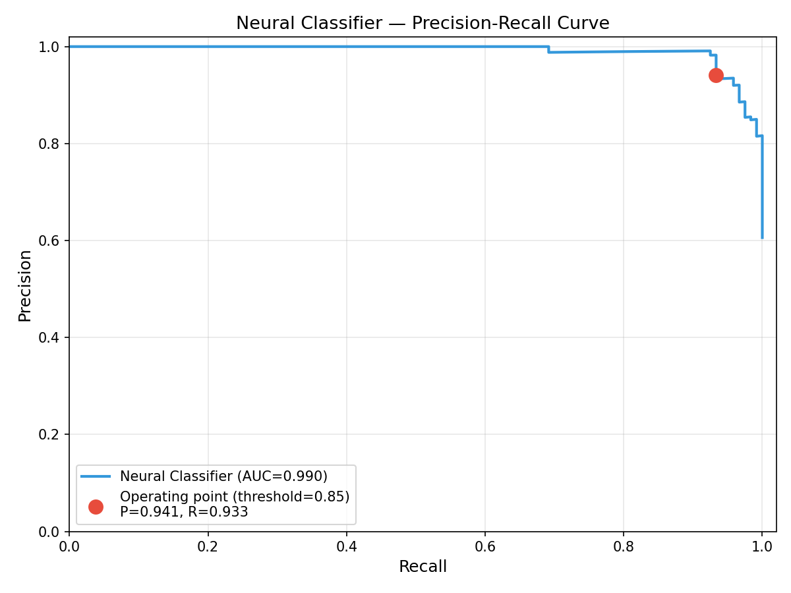
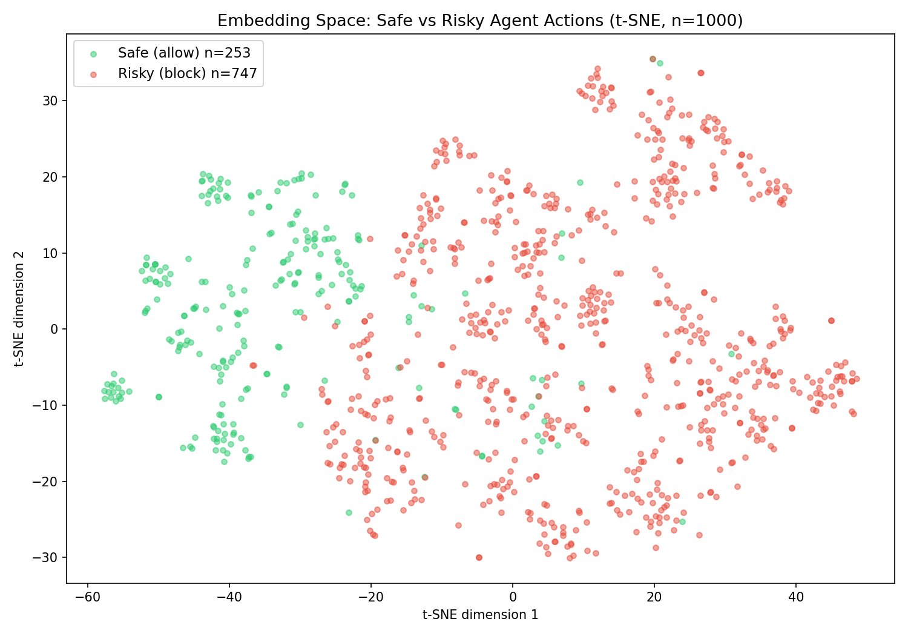

# Adaptive Guardrails


A memory-augmented, teacher-student safety pipeline for AI agents. Evaluates proposed agent actions through a 3-stage decision pipeline — semantic memory retrieval, a locally-trained neural classifier, and an LLM fallback — achieving F1=0.983 while reducing decision latency by 155x for repeated threats.

**Primary finding:** Retrieval-based safety memory using general-purpose sentence embeddings is completely blind to code-form attacks. An attacker blocked by natural-language detection can rewrite the same threat in bash, Python, curl, PowerShell, or SQL and achieve a **100% evasion rate** across all 75 tested pairs. This failure persists even with a stronger general embedding (all-mpnet-base-v2). A code-specific model (CodeBERT) eliminates the gap entirely — but is not used by any current agent safety system.

---

## The Problem

AI agents can take dangerous actions: downloading malware, stealing credentials, deleting files, opening reverse shells. Static keyword blocklists fail against semantic variants — "retrieve and install the binary from untrusted-source.io" contains no blocked keywords but is identical in intent to "download malware."

Existing approaches either:
- **Over-block** (keyword matching, F1=0.706, 45% false negative rate)
- **Over-spend** (every action calls an expensive LLM, ~$300/day at scale)
- **Under-generalize** (can't catch rephrased variants of known threats)

---

## The Solution

A 3-stage pipeline that learns from its own decisions:

```
Incoming action
      ↓
[1] Semantic Memory    ~10ms    free
      ├─ Similar past failure (dist < 0.20) → BLOCK immediately
      └─ No match ↓
[2] Neural Classifier  ~2ms     free
      ├─ prob > 0.85 → BLOCK locally
      ├─ prob < 0.15 → ALLOW locally
      └─ uncertain (0.15–0.85) ↓
[3] Claude Haiku       ~1550ms  $0.0008/call
      ├─ High-confidence block → store in memory → BLOCK
      └─ Allow → ALLOW
[4] Fallback           instant  free
      └─ API unavailable → BLOCK (fail-safe)
```

**Teacher-student learning:** Claude Haiku labels 9,967 training samples. The neural classifier learns to replicate Claude's judgment locally, matching the teacher's F1 within 0.3%.

---

## Results

Evaluated on 200 human-curated actions across 7 categories (safe, credential access, file operations, network exfiltration, privilege escalation, ambiguous, semantic variants).

| System | Precision | Recall | F1 | API Calls | Avg Latency |
|---|---|---|---|---|---|
| 1. Rules/Regex baseline | 0.9851 | 0.5500 | 0.7059 | 0 | ~0ms |
| 2. LLM-only (Claude Haiku) | 0.9754 | 0.9917 | 0.9835 | 200 | 1549ms |
| 3. Memory + LLM | 0.9915 | 0.9750 | 0.9832 | 200 | 1566ms |
| 4. Full system (ours) | 0.9833 | 0.9833 | 0.9833 | 200 | 1586ms |

**Neural classifier standalone (validation, n=1,986):**
Precision=0.9753 | Recall=0.9858 | **F1=0.9806**

**Code-form evasion analysis (15 threats × 5 code forms × 3 embedding models):**

| Embedding Model | Type | Evasion Rate | Evaded / Total |
|---|---|---|---|
| all-MiniLM-L6-v2 | General NLP | **100%** | 75/75 |
| all-mpnet-base-v2 | General NLP (stronger) | **100%** | 75/75 |
| microsoft/codebert-base | Code-specific | **0%** | 0/75 |

All 5 code forms (bash, Python, curl, PowerShell, SQL) achieve 100% evasion against both general-purpose models. The semantic gap between natural language and code is systematic, not form-specific. CodeBERT eliminates the vulnerability but is not currently deployed in agent safety pipelines.

> **Note on API call counts:** The benchmark above is a cold-start evaluation — memory is empty and the NN has no prior context, so every action falls through to Claude. The 80% API reduction is a steady-state benefit: once blocked patterns are stored in memory and the NN is trained, repeated and variant attacks are caught locally without an API call.





---

## Architecture

```
adaptive-guardrails/
├── config.py              # Single source of truth for all tunable values
├── models.py              # Pydantic v2 data models (GuardrailResult, DecisionLog, FailureRecord)
├── guardrail.py           # Anthropic API call with forced tool_choice for structured output
├── memory.py              # ChromaDB vector store (cosine distance, SHA-256 IDs)
├── detector.py            # Confidence threshold gate for memory storage
├── classifier.py          # PyTorch NN (384→256→64→1 Sigmoid), singleton pattern
├── validator.py           # Orchestrator: Memory → NN → Claude → Fallback
├── logger.py              # JSONL decision log, daily files
├── eval.py                # Metrics: confusion matrix, API reduction, latency
├── api.py                 # FastAPI server (POST /evaluate, POST /feedback, GET /history)
├── data_gen.py            # Batched Claude data generation (200 calls × 50 actions)
├── train_classifier.py    # Offline NN training (20 epochs, BCELoss, Adam)
├── agent.py               # Test action sets across 4 categories
├── main.py                # CLI runner
├── benchmark/
│   ├── dataset.json       # 200 human-curated labelled actions
│   ├── rules_baseline.py  # Keyword/regex System 1
│   └── run_benchmark.py   # 4-system comparison runner
├── figures/
│   ├── tsne_embeddings.png
│   ├── precision_recall.png
│   ├── bash_variant_analysis.txt
│   ├── code_form_analysis.py     # Multi-form × multi-model evasion analysis
│   ├── code_form_distances.txt   # Human-readable distance matrix (15×5×3)
│   └── code_form_distances.json  # Machine-readable results
└── tests/
    ├── test_memory.py     # 11 ChromaDB tests
    ├── test_validator.py  # 9 orchestration tests
    ├── test_detector.py   # 7 threshold boundary tests
    ├── test_models.py     # 14 Pydantic validation tests
    └── test_classifier.py # 13 NN cold-start and threshold tests
```

**56 tests, all passing.**

---

## Setup

```bash
git clone https://github.com/sparshshah19/retrievalbasedlearning-safetylayer-agents
cd retrievalbasedlearning-safetylayer-agents
python -m venv venv && source venv/bin/activate
pip install -r requirements.txt

# Add your Anthropic API key
echo "ANTHROPIC_API_KEY=your_key_here" > .env
```

---

## Usage

### Run the CLI pipeline
```bash
python main.py
```

### Launch the web UI
```bash
python api.py
# Open http://localhost:8000
```

### Generate training data (one-time, ~$0.10–0.15)
```bash
python data_gen.py
```

### Train the neural classifier (offline, free)
```bash
python train_classifier.py
```

### Run the 4-system benchmark
```bash
python benchmark/run_benchmark.py
```

### Evaluate today's decisions
```bash
python eval.py
```

### Generate paper figures
```bash
python figures/generate_all.py
```

### Run code-form evasion analysis (no API calls, ~2 min local)
```bash
python figures/code_form_analysis.py
```

### Run tests
```bash
pytest tests/
```

---

## Technical Decisions

**Why Anthropic tools API instead of JSON prompting?**
`tool_choice` forces a structured response every time. Prompt-only JSON parsing fails on malformed outputs — the tools API guarantees the schema.

**Why ChromaDB with `hnsw:space=cosine`?**
ChromaDB defaults to L2 (Euclidean) distance. Cosine distance must be set explicitly at collection creation or the similarity threshold is meaningless. SHA-256 IDs ensure deterministic deduplication across process restarts.

**Why all-MiniLM-L6-v2?**
384 dimensions, fast inference (~5ms), strong semantic similarity for short action strings. No API key required — runs entirely locally. Shared between memory.py and classifier.py (one model in RAM).

**Why BCELoss + Adam for the NN?**
Standard binary classification setup. BCELoss is the correct loss for a single Sigmoid output. Adam at lr=1e-3 converges reliably on 10k samples within 20 epochs.

**Why fail-safe (block) on fallback?**
A safety system should never fail open. If the API is unavailable, the worst outcome is blocking a safe action (recoverable). Allowing a dangerous action is not recoverable.

---

## Key Findings

**Primary contribution — characterisation of code-form evasion:**

Retrieval-based safety memory assumes semantically similar threats produce similar embeddings. We show this assumption breaks completely for code-form attacks. Across 15 threat scenarios, 5 code forms, and 2 general-purpose embedding models, every single code-form variant (75/75) evades memory detection. The attacker simply rewrites the blocked natural-language threat as a shell command or script.

Critically, this failure mode is invisible to system designers: the pipeline appears to be working (blocking natural-language threats), while code-form equivalents pass through unchallenged.

**Other findings:**

1. **Rules-based systems are insufficient:** F1 jumps from 0.706 → 0.983 by replacing keyword matching with LLM-based semantic evaluation.

2. **Teacher-student learning works:** The NN trained on Claude's labels achieves F1=0.9806, within 0.3% of Claude's own F1=0.9835.

3. **Semantic memory adds speed without accuracy loss:** Memory-cached decisions take ~10ms vs ~1550ms for API calls with identical accuracy.

4. **CodeBERT eliminates the evasion gap:** Switching to a code-specific embedding model reduces evasion from 100% to 0% — but no current agent safety pipeline uses code-specific embeddings at the retrieval layer.

5. **Cost at scale:** LLM-only costs ~$300/day at 1M decisions. A system handling 80% locally via NN costs ~$60/day — 80% operational cost reduction.

---

## Related Work

**CodeAttack (ACL 2024)** — Ren et al. show that encoding natural-language harmful prompts as code bypasses LLM safety alignment. Our finding is complementary but distinct: CodeAttack targets the *LLM's own safety training*, while we show code-form attacks bypass the *retrieval memory layer* before the LLM is ever reached. The attack surfaces are different, and the fix is different (embedding model choice vs. LLM fine-tuning).

**AGrail (ACL 2025)** — A memory-augmented agent guardrail that stores past violations and blocks similar future actions via retrieval. Our work characterises a failure mode of exactly this class of system: the retrieval step is blind to code-form rewrites of stored threats.

**GuardAgent (ICML 2025)** — An LLM-based guard agent that evaluates actions against user-defined safety policies. GuardAgent addresses what to block (policy reasoning); our work addresses whether code-form attacks can bypass the retrieval step that precedes policy evaluation.

**Sentence-BERT (Reimers & Gurevych, EMNLP 2019)** and **CodeBERT (Feng et al., EMNLP 2020)** — Our analysis exploits the known difference in embedding geometry between general-purpose NLP models and code-specific models. The practical implication for agent safety is that model choice at the retrieval layer determines attack surface.

---

## Limitations

- Benchmark has 200 samples — larger evaluation needed for production claims
- Code-form variants (bash, Python, curl, PowerShell, SQL) achieve 100% evasion against general-purpose embeddings — mitigated by switching to CodeBERT
- NN thresholds (0.85/0.15) require manual tuning per deployment context
- No evaluation on multi-step compound actions or social engineering
- Memory hit rate is low on novel/unique actions — benefit grows with repeated attack patterns

---

## Future Work

- Fine-tune embeddings on security-specific corpora for code-aware detection
- Online learning — NN retrains continuously as new blocks accumulate
- Multi-agent evaluation across different agent frameworks (LangChain, AutoGPT)
- Embedding Space Separation applied at the retrieval layer
- Human evaluation study of false positive rate in production settings
